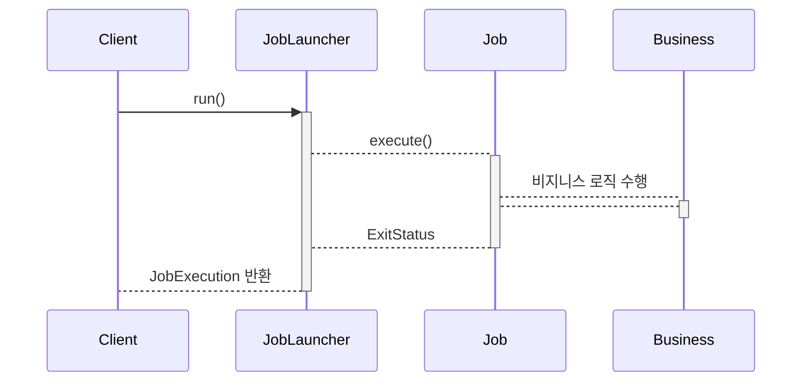
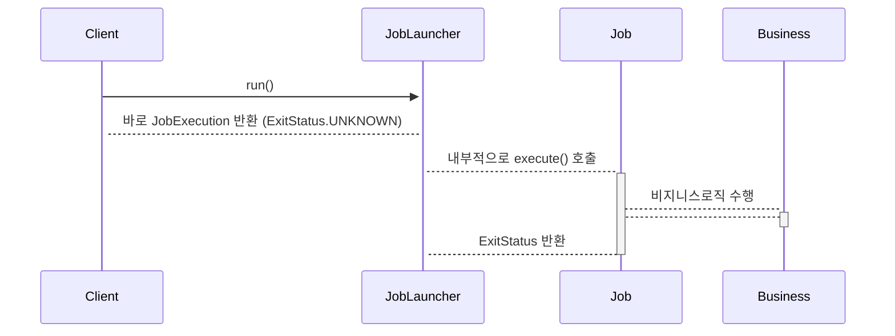

# Job이란 무엇인가?

<br>

## 1. Job이란?

### 기본 개념

- Job은 하나 이상의 Step을 가지고 있는 컨테이너로써 하나의 배치 작업을 나타냅니다.
- Job은 JobInstance로 표현되며, JobInstance는 Job의 실행에 대한 실제 인스턴스를 나타냅니다.

<br>

### 기본 구현체

#### SimpleJob

- 순차적으로 Step을 실행시키는 Job입니다.
- 대부분의 Job에서 유용하게 사용할 수 있는 표준 기능입니다.

#### FlowJob

- 특정한 조건과 흐름에 따라 Step을 구성하여 실행시키는 Job입니다.
- Flow 객체를 실행시켜 작업을 진행합니다.

<br>

### 흐름도


<br>

## 2. JobInstance란 무엇인가?

### 기본 개념

- JobInstance는 Job이 실행될 때 생성되는 논리적 실행 단위 객체로써 고유하게 식별 가능한 작업 실행을 나타냅니다.
- Job의 설정과 구성은 동일하지만 Job이 실행되는 시점에 처리하는 내용은 다르기 때문에 Job의 실행을 구분해야 합니다.
  - 예를들어 하루에 한번씩 특정시간에 Job이 실행된다면 실행되는 각각의 Job을 JobInstance로 표현합니다.
  - 즉 Job과 JobInstance는 1:N의 관계입니다.

<br>

### JobInstance의 생성

- Job이 처음 실행된다면 새로운 JobInstance가 생성됩니다. 만약 시간이 지나 동일한 Job이 실행된다면 이전의 JobInstance가 반환됩니다.
- 내부적으로 JobName과 JobKey(JobParameter의 해시값)를 가지고 JobInstance 객체를 얻습니다.

<br>

### 흐름도

1. JobLauncher는 개발자가 구성한 Job을 실행시키는 역할을 하는 클래스로 Job과 JobParameter를 인자로 받아 Job을 실행시킵니다.
2. JobRepository 인터페이스의 구현체인 SimpleJobRepository 클래스에서 JobInstance가 있는지 없는지 확인하는 로직을 거치게 됩니다.


<br>

### 코드로 따라가기

#### 1. JobLauncher에 의해 run 메서드 호출

- 만약 JobParameter가 동일한 파라미터라면 즉 아래 코드 상에서 time을 '2024-08-29 21:41:20.101574'처럼 하드코딩 했다면 예외가 발생하게 됩니다.
  - A job instance already exists ~ 예외가 발생합니다.

```java
@Component
@RequiredArgsConstructor
public class ProductScheduler {

    private final JobLauncher jobLauncher;
    private final JobRegistry jobRegistry;

    // ... 코드 생략

    @Scheduled(cron = "0/10 * * * * *") // 10초마다 실행
    public void run() {
        var time = LocalDateTime.now().toString();
        var job = jobRegistry.getJob("productJob"); // job 이름
        var jobParam = new JobParametersBuilder().addString("time", time);
        // JobLauncher의 run() 메서드를 통해 Job 실행
        jobLauncher.run(job, jobParam.toJobParameters());
    }
}
```

<br>

#### 2. SimpleJobLauncher 클래스의 run 메서드 실행

- 브레이크 포인터를 잡고 디버깅을 해보면 JobInstance 객체가 생성되는 로직을 파악할 수 있습니다. 간단히 아래 코드를 보면 run() 메서드 내부의 getLastJobExecution() 메서드를 통해 JobExecution 객체를 반환받게 되며, JobExecution 객체가 NULL이라면 
createJobExecution() 메서드를 통해 새로운 JobExecution 객체를 생성하게 됩니다.

```java
public class SimpleJobLauncher implements JobLauncher, InitializingBean {

        private JobRepository jobRepository;
	// ... 생략

	public JobExecution run(final Job job, final JobParameters jobParameters) throws JobExecutionAlreadyRunningException, JobRestartException, JobInstanceAlreadyCompleteException, JobParametersInvalidException {
		// ... 생략

		// 가장 최신의 Job 조회
		JobExecution lastExecution = this.jobRepository.getLastJobExecution(job.getName(), jobParameters);
		if (lastExecution != null) {
			// ... 생략
		}

		job.getJobParametersValidator().validate(jobParameters);
		
		// 가장 최신의 Job이 없다면 Job 생성
		final JobExecution jobExecution = this.jobRepository.createJobExecution(job.getName(), jobParameters);

		try {
			this.taskExecutor.execute(new Runnable() {
				// ... 생략
			});
		} catch (TaskRejectedException var8) {
			TaskRejectedException e = var8;
			jobExecution.upgradeStatus(BatchStatus.FAILED);
			if (jobExecution.getExitStatus().equals(ExitStatus.UNKNOWN)) {
				jobExecution.setExitStatus(ExitStatus.FAILED.addExitDescription(e));
			}

			this.jobRepository.update(jobExecution);
		}

		return jobExecution;
	}
}

public class SimpleJobRepository implements JobRepository {

	// ... 코드 생략

	@Nullable
	public JobExecution getLastJobExecution(String jobName, JobParameters jobParameters) {
		JobInstance jobInstance = this.jobInstanceDao.getJobInstance(jobName, jobParameters);
		if (jobInstance == null) {
			return null;
		} else {
			JobExecution jobExecution = this.jobExecutionDao.getLastJobExecution(jobInstance);
			if (jobExecution != null) {
				jobExecution.setExecutionContext(this.ecDao.getExecutionContext(jobExecution));
				this.stepExecutionDao.addStepExecutions(jobExecution);
			}

			return jobExecution;
		}
	}

	public JobExecution createJobExecution(String jobName, JobParameters jobParameters) throws JobExecutionAlreadyRunningException, JobRestartException, JobInstanceAlreadyCompleteException {
		JobInstance jobInstance = this.jobInstanceDao.getJobInstance(jobName, jobParameters);
		ExecutionContext executionContext;
		if (jobInstance == null) {
			jobInstance = this.jobInstanceDao.createJobInstance(jobName, jobParameters);
			executionContext = new ExecutionContext();
		} else {
			List<JobExecution> executions = this.jobExecutionDao.findJobExecutions(jobInstance);
			// ... 코드 생략
		
			while(true) {
				// ... 코드 생략
			}
		}

		JobExecution jobExecution = new JobExecution(jobInstance, jobParameters);
		jobExecution.setExecutionContext(executionContext);
		jobExecution.setLastUpdated(LocalDateTime.now());
		this.jobExecutionDao.saveJobExecution(jobExecution);
		this.ecDao.saveExecutionContext(jobExecution);
		return jobExecution;
	}
}
```

<br>

## 3. JobParameter란 무엇인가?

### 기본 개념

- Job을 실행할 때 함께 포함되어 사용되는 파라미터를 가진 객체입니다.
- 하나의 Job에 존재할 수 있는 여러개의 JobInstance를 구분하기 위한 용도입니다.
- JobParameter와 JobInstance는 1:1 관계입니다.

<br>

### 코드로 살펴보기

- JobParameter에 값을 세팅하면 Job이 실행될 때 Tasklet에서 세팅한 값을 가져올 수 있습니다.

```java
@Component
@RequiredArgsConstructor
public class ProductScheduler {

    private final JobLauncher jobLauncher;

    @Scheduled(cron = "0/5 * * * * *") // 5초마다 실행
    public void run() {
        var now = LocalDateTime.now();
        var user = "KDG";
        try {
            var job = jobRegistry.getJob("testJob");

            // JobParameter 생성
            var jobParam = new JobParametersBuilder()
                    .addString("user", user)
                    .addLocalDateTime("now", now);
            jobLauncher.run(job, jobParam.toJobParameters());
        } catch (NoSuchJobException e) {
            throw new RuntimeException(e);
        } catch (JobInstanceAlreadyCompleteException | JobExecutionAlreadyRunningException | JobParametersInvalidException | JobRestartException e) {
            throw new RuntimeException(e);
        }
    }
}

@Configuration
@RequiredArgsConstructor
public class ProductJobConfiguration extends DefaultBatchConfiguration {

    @Bean
    public Job job(JobRepository jobRepository, Step step) {
        return new JobBuilder("testJob", jobRepository)
                .start(step)
                .build();
    }

    @Bean
    public Step step(JobRepository jobRepository, Tasklet tasklet, PlatformTransactionManager manager) {
        return new StepBuilder("testStep", jobRepository)
                .tasklet(tasklet, manager)
                .build();
    }

    @Bean
    public Tasklet tasklet() {
        return (contribution, chunkContext) -> {
            
            // Job이 실행되면 JobParameter에 설정해놓은 값은 가져올 수 있습니다.
            JobParameters jobParameters = contribution.getStepExecution().getJobExecution().getJobParameters();
            System.out.println("user: " + jobParameters.getString("user"));
            System.out.println("now: " + jobParameters.getLocalDateTime("now"));
            return RepeatStatus.FINISHED;
        };
    }
}
```

<br>

## 4. JobExecution란 무엇인가?

### 기본 개념

- JobInstance가 실행 중에 발생하는 정보들을 저장하고 있는 객체입니다.
  - 시작시간, 종료시간, 상태의 정보를 가지고 있습니다.
- JobExecution는 FAILED 또는 COMPLETED 등의 Job 실행 결과 상태를 가지고 있습니다.
- JobExecution의 상태가 COMPLETED라면 실행이 완료된 것으로 간주하여 재실행이 불가능합니다.
- JobExecution의 상태가 FAILED라면 실패한것으로 간주하여 재실행 가능합니다. 즉 COMPLETED될 때까지 재시도할 수 있습니다.

<br>

### 흐름도


<br>
<br>

## 5. JobRepository란 무엇인가?

### 기본 개념

- 배치 작업 중의 정보를 저장하는 저장소의 역할을 수행합니다.
- Job이 언제 수행되었고, 언제 끝났으며, 몇 번이 실행되었고, 실행에 대한 결과 등의 배치 작업의 수행과 관련된 모든 메타데이터를 저장합니다.


<br>
<br>

## 6. JobLauncher란 무엇인가?

### 기본 개념

- Job을 실행시키는 역할을 수행합니다.
- Job과 JobParameter를 인자로 받으며 요청한 배치 작업을 수행한 뒤 최종 클라이언트에게 JobExecution을 반환합니다.

<br>

### Job의 실행

#### 동기적 실행

- taskExecutor를 SyncTaskExecutor로 설정할 경우입니다.
- JobExecution을 획득하고 배치처리를 최종 완료한 후 클라이언트에게 JobExecution을 반환할 때입니다.
- 스케줄러에 의한 배치처리에 적합합니다.

#### 동기적 실행의 흐름




#### 비동기적 실행

- taskExecutor가 SimpleASyncTaskExecutor로 설정할 경우입니다.
- JobExecution을 획득한 후 클라이언트에게 바로 JobExecution을 반환하고 이후에 배치처리를하는 경우입니다.
- HTTP 요청에 의한 배치처리에 적합합니다. (배치처리 시간이 길 경우 응답이 늦어지지 않도록 하기 위함입니다.)

#### 비동기적 실행의 흐름

- 비동기적 실행에서는 우선 JobLauncher는 클라이언트에게 바로 JobExecution를 반환하게 됩니다. 이때 JobExecution의 ExitStatus 상태는 UNKNOWN이게 됩니다.



<br>
<br>

#### 참고

- https://jojoldu.tistory.com/490 (JobParameter 활용 방법에 대한 글입니다.)


