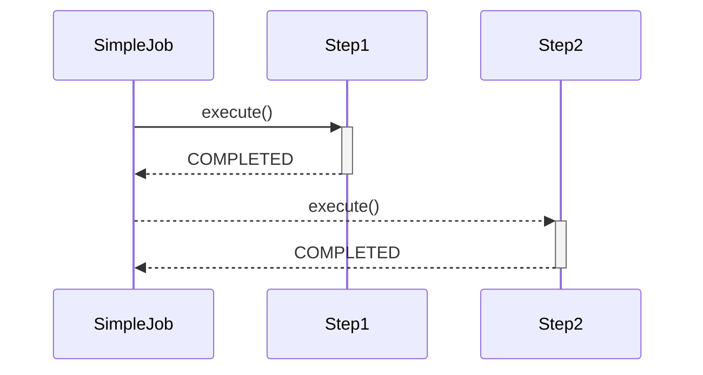
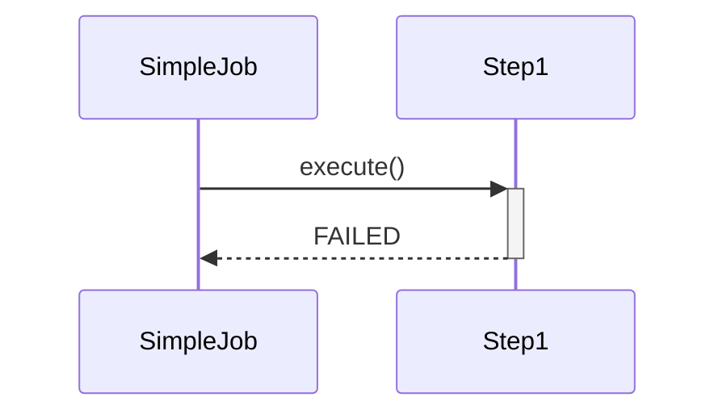

# SimpleJob이란 무엇인가?

<br>

## 1. 기본 개념

- SimpleJob은 Step을 실행시키는 Job 인터페이스의 구현체이며, SimpleJobBuilder에 의해 생성됩니다.
- 여러 단계의 Step으로 구성할 수 있으며, Step을 '순차적'으로 실행시킵니다.
- 모든 Step이 성공적으로 완료되어야 Job이 성공적으로 완료됩니다.
- 최종 마지막에 실행된 Step의 BatchStatus가 최종 Job의 BatchStatus가 됩니다.

### 흐름도

#### 성공적인 흐름도

- SimpleJob이 Step1을 실행시키고 Step1이 성공적으로 작업이 완료되면 이후 SimpleJob이 Step2를 실행시킵니다.



#### 실패 흐름도

- SimpleJob이 Step1을 실행시키고 Step1의 작업이 실패하면 이후 Step2는 호출되지 않습니다.



<br>

## 2. 주요 API

### start()

- 처음 실행할 Step을 설정합니다. 또한 start() 메서드는 SimpleJobBuilder 객체를 생성하고 반환하게 됩니다.

<br>

### next()

- 처음 Step이후에 실행할 Step들을 순차적으로 연결하도록 설정합니다.
- 여러 Step을 구성할 수 있으며, 모든 next() 메서드의 Step이 종료되면 Job이 종료됩니다.

<br>

### validator()

- Job 실행에 필요한 파라미터를 검증하는 역할을 수행합니다.

```java
public class CustomJobParametersValidator implements JobParametersValidator {

    @Override
    public void validate(JobParameters parameters) throws JobParametersInvalidException {
        if (!StringUtils.hasText(parameters.getString("name"))) {
            throw new JobParametersInvalidException("name parameters is not found");
        }
    }
}

@Configuration
@RequiredArgsConstructor
public class ProductJobConfiguration {

    @Bean
    public Job job(JobRepository jobRepository, Step step) {
        return new JobBuilder("exampleJob", jobRepository)
                .start(step)
                .validator(new CustomJobParametersValidator()) // custom validator 주입 
                .build();
    }

    @Bean
    public Step step(JobRepository jobRepository, PlatformTransactionManager manager) {
        return new StepBuilder("exampleJob", jobRepository)
                .tasklet((contribution, chunkContext) -> {
                    System.out.println("Example Step Execute !!!!");
                    return RepeatStatus.FINISHED;
                }, manager)
                .build();
    }
}

@Component
@RequiredArgsConstructor
public class ProductScheduler {

    private final JobLauncher jobLauncher;
    private final JobRegistry jobRegistry;

    @Scheduled(cron = "0/5 * * * * *") // 5초마다 실행
    public void run() {
        try {
            var job = jobRegistry.getJob("exampleJob");

            var jobParam = new JobParametersBuilder()
                    .addString("user", "KDG")
                    .addLocalDateTime("now", LocalDateTime.now());
            jobLauncher.run(job, jobParam.toJobParameters());
        } catch (Exception e) {
            throw new RuntimeException(e);
        }
    }
}

// 예외 발생
// name parameters is not found
```

<br>

### preventRestart()

- Job의 재시작 여부를 설정합니다.
- 기본값은 true이며, false로 설정시 해당 Job을 재시작하지 않습니다.
- Job이 실패하더라도 재시작하지 않으며, 만약 Job을 재시작하려고 하면 JobRestartException이 발생합니다.

#### preventRestar의 흐름도 

1. JobInstance 생성시 preventRestart() 메서드를 호출하여 restartable 값을 false로 지정합니다.
2. JobExecution에 의해 Step이 실행되던 중 예외가 발생하여 Status가 FAILED이 되고 재시작 로직이 수행될 때 restartable의 값을 확인하게 됩니다. 이때 restartable의 값이 false이기 때문에 재시작을 하지 못하고 예외가 발생합니다. (JobRestartException) 


<br>

```java
public class SimpleJobLauncher implements JobLauncher, InitializingBean {

    // ... 코드 생략

    public JobExecution run(final Job job, final JobParameters jobParameters) throws JobExecutionAlreadyRunningException, JobRestartException, JobInstanceAlreadyCompleteException, JobParametersInvalidException {
        if (this.jobLaunchCount != null) {
            this.jobLaunchCount.increment();
        }

        JobExecution lastExecution = this.jobRepository.getLastJobExecution(job.getName(), jobParameters);
        if (lastExecution != null) {
            // preventRestart() 메서드 호출로 인하여 restartable의 값은 false가 되면서 해당 if 분기에 걸리게 됩니다.
            if (!job.isRestartable()) {
                throw new JobRestartException("JobInstance already exists and is not restartable");
            }

            // ... 코드 생략
        }

        // ... 코드 생략

        return jobExecution;
    }
}
```

<br>

### incrementer()

- JobParameters에서 필요한 값을 증가시켜 다음에 사용될 JobParameters 객체를 반환합니다.
- 기존의 JobParameter 변경없이 Job을 여러번 재시작할 때 사용됩니다.
- https://jojoldu.tistory.com/487 참고글

<br>

## 3. SimpleJob 흐름도

1. SimpleJob 객체가 생성되기 전 JobParameters, JobInstance, JobExecution 객체가 생성됩니다.
2. SimpleJob은 실행되기전 JobListener 클래스의 beforeJo0b() 메서드를 호출합니다.
3. Step에 의해 StepExecution, ExecutionContext 객체가 생성되고 Tasklet 내부에서 비지니스 로직이 수행됩니다.
4. 작업이 완료되면 JobListener 클래스의 afterJob() 메서드가 호출됩니다.
5. 최종적으로 StepExecution의 status와 existStatus를 JobExecution에 할당하면서 최종 반납이 됩니다.
   


<br>
<br>

#### StepExecution의 status와 existStatus를 JobExecution에 할당하면서 최종 반납

- 아래 코드는 SimpleJob 클래스의 doExecute() 메서드 일부입니다. 

```java
public class SimpleJob extends AbstractJob {

    private final List<Step> steps;

    // ... 코드 생략

    protected void doExecute(JobExecution execution) throws JobInterruptedException, JobRestartException, StartLimitExceededException {
        StepExecution stepExecution = null;
        Iterator var3 = this.steps.iterator();

        while(var3.hasNext()) {
            Step step = (Step)var3.next();
            stepExecution = this.handleStep(step, execution);
            if (stepExecution.getStatus() != BatchStatus.COMPLETED) {
                break;
            }
        }

        if (stepExecution != null) {
            if (logger.isDebugEnabled()) {
                logger.debug("Upgrading JobExecution status: " + stepExecution);
            }
            
            // StepExecution의 status와 ExitStatus를 JobExecution에 할당해주고 있는 코드입니다.
            execution.upgradeStatus(stepExecution.getStatus());
            execution.setExitStatus(stepExecution.getExitStatus());
        }

    }
}
```


