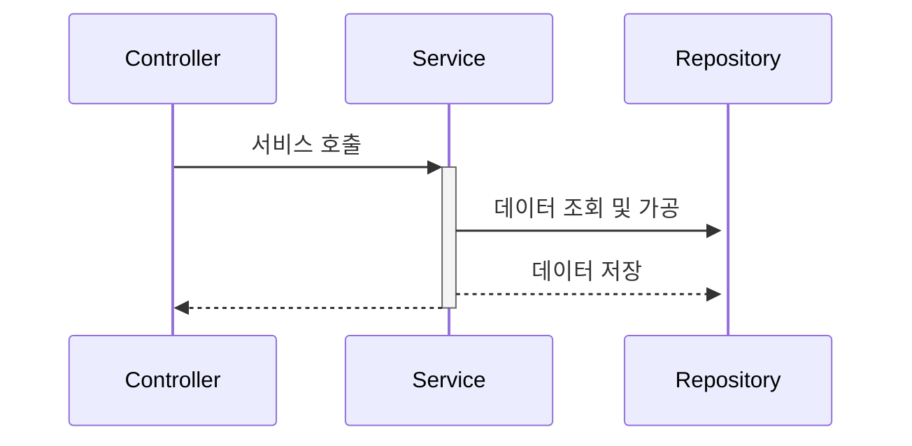
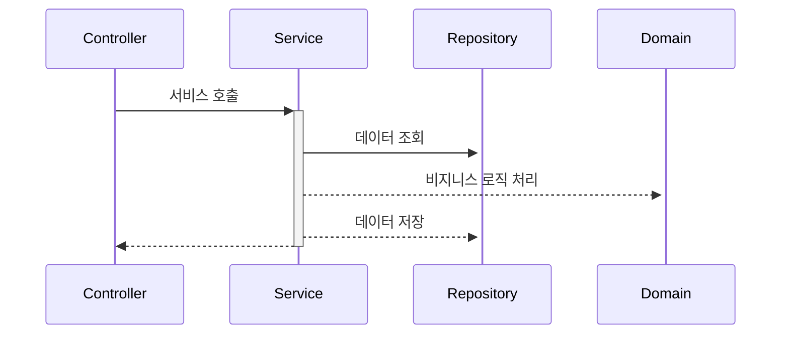

# 안티패턴

## 1. 스마트 UI

- 스마트 UI 패턴은 에릭 에반스의 저서 '도메인 주도 설계'에서 소개돼 유명해진 안티패턴입니다.

#### 스마트 UI란?

- 지나치게 많은 일을 하고 있는 상황을 비꼬아 표현한 것입니다.
  - 데이터 입출력을 UI 레벨에서 처리합니다.
  - 비지니스 로직을 UI 레벨에서 처리합니다.
  - 외부 모듈(데이터 베이스)와 통신하는 로직을 UI 레벨에서 처리합니다.

#### 예제 코드

- 아래 PostController의 create 메서드를 보면 하나의 함수에서 모든 로직을 처리하는 것을 확인할 수 있습니다.
- 컨트롤러의 역할은 클라이언트의 요청을 받아 서비스를 호출하고 결과값을 다시 클라이언트에게 반환하는 것입니다.

```java
@RestController
@RequestMapping("/posts")
@RequiredArgsConstructor
public class PostController {
    
    private final PostRepository postRepository;
    private final MemberRepository memberRepository;
    
    public void create(@RequestBody @Valid PostCreateRequest request) {
        // request 유효성 검증
        validate(request);
        
        // 유효한 회원인지 검증
        Member member = memberRepository.findById(1L)
                .orElseThrow(IllegalStateException::new);

        postRepository.save(...);
    }
}
```

<br>

#### 스마트 UI에 대한 고민점

- 스마트 UI 방식을 사용하면 빨리 개발할 수 있다고 생각할 수도 있습니다. 하지만 시간이 지나고 추가적인 요구사항이 들어오게 된다면 코드가 복잡해지고, 코드를 작성한 사람만 이해할 수 있게 됩니다.
- 우리가 개발해야하는 것은 '지속 가능한' 소프트웨어 입니다. 따라서 이러한 방식은 안티 패턴입니다.

<br>

## 2. 양방향 레이어드 아키텍처

- 양방향 레이어드 아키텍처란 레이어들 간의 의존 관계가 양방향으로 발생하는 경우를 말합니다.
- 레이어드 아키텍처에서 레이어 간의 의존 방향은 단방향을 유지해야 합니다.
- 레이어드 아키텍처에는 레이어 간 통신은 인접한 레이어끼리 이루어져야 합니다.


<br><br>

#### 양방향 레이어드 아키텍처 예제 코드

- 아래 todo를 생성하는 코드를 보면 TodoCreateService 클래스에서 TodoCreateRequest, TodoCreateResponse 클래스에 의존하고 있는 것을 확인할 수 있습니다. 두 클래스는 Presentation Layer에 위치한 클래스이므로 순환 참조가 발생합니다.
- 저는 실무에서 이러한 코드를 정말 많이 작성을 했었습니다.

```java
// Presentation Layer
public record TodoCreateRequest(@NotBlank String title, @NotBlank String contents) {

}

public record TodoCreateResponse(Long todoId) {

}

@RestController
@RequestMapping("/todos")
@RequiredArgsConstructor
public class TodoApi {

    private final TodoCreateService todoCreateService;

    @PostMapping
    public TodoCreateResponse create(@Valid @RequestBody TodoCreateRequest request) {
        return this.todoCreateService.create(request);
    }
}

// Business Layer
@Service
@Transactional
@RequiredArgsConstructor
public class TodoCreateService {

    private final MemberDaoPort memberDaoPort;
    private final TodoDaoPort todoDaoPort;

    public TodoCreateResponse create(TodoCreateRequest request) {
        var member = memberDaoPort.findByMemberId(1L)
                .orElseThrow(() -> new MemberException(ErrorCode.ERROR_AVAILABLE_MEMBER_NOT_FOUND));

        var todo = Todo.builder()
                .title(request.title())
                .contents(request.contents())
                .createdDatetime(LocalDateTime.now())
                .member(member)
                .build();

        todoDaoPort.save(todo);

        return new TodoCreateResponse(todo.getId());
    }
}
```

<br>

### 🧐 어떻게 순환 참조를 해결할 수 있을까?

#### 1. 레이어별 모델 구성

```java
// Presentation Layer
public record TodoCreateRequest(@NotBlank String title, @NotBlank String contents) {

}

public record TodoCreateResponse(Long todoId) {

}

@RestController
@RequestMapping("/todos")
@RequiredArgsConstructor
public class TodoApi {

    private final TodoCreateService todoCreateService;

    @PostMapping
    public TodoCreateResponse create(@Valid @RequestBody TodoCreateRequest request) {
        var todoCreateCommand = new TodoCreateCommand(request.title(), request.contents());
        var response = this.todoCreateService.create(todoCreateCommand);
        
        return new TodoCreateResponse(response.todoId());
    }
}

// Business Layer
public record TodoCreateCommand(String title, String contents) {

}

public record TodoCreateCommandResponse(Long todoId) {

}

@Service
@Transactional
@RequiredArgsConstructor
public class TodoCreateService {

    private final MemberDaoPort memberDaoPort;
    private final TodoDaoPort todoDaoPort;

    public TodoCreateCommandResponse create(TodoCreateCommand request) {
        var member = memberDaoPort.findByMemberId(1L)
                .orElseThrow(() -> new MemberException(ErrorCode.ERROR_AVAILABLE_MEMBER_NOT_FOUND));

        var todo = Todo.builder()
                .title(request.title())
                .contents(request.contents())
                .createdDatetime(LocalDateTime.now())
                .member(member)
                .build();

        todoDaoPort.save(todo);

        return new TodoCreateCommandResponse(todo.getId());
    }
}
```

<br>

#### 💡 어떻게 개선되었나?

- xxxCommand, xxxCommandResponse 클래스를 둠으로써 순한 참조 문제를 해결하였습니다. 히자만 클래스를 더 많이 만들어야하는 단점이 있습니다.
- 비슷한 클래스가 많아지고 코드 중복처럼 느껴질 수 있지만 비슷한 클래스가 많아지는 것은 맞지만 코드 중복은 아닙니다. 중복은 역할과 책임, 구현 등이 비슷할 때를 보고 중복이라 부릅니다. 그래서 데이터 형태가 유사하다고 해서 중복이라 보기는 어렵습니다.


<br>

#### 2. 공통 모듈 구성

- 05장 순환 참조에서 순환 참조를 해결하는 방법에서 소개했던 내용입니다.
- 개인적으로 이 방법은 문제를 해결한게 아닌 회피한 것처럼 보입니다.


<br><br>

## 3. 완화된 레이어드 아키텍처

- 완화된 레이어드 아키텍처란 상위 레이어에서 모든 하위 레이어에 접근할 수 있는 권한을 주는 구조를 가리킵니다.
- 컨트롤러에서 바로 리포지토리에 접근해도 괜찮을까요?
  - 좋은 구조가 아닙니다.
 
#### 🧨 발생할 수 있는 문제점

- 이러한 아키텍처에서는 스마트 UI와 같은 문제가 발생할 수 있고, 개발자 성향마다 코드를 작성하는게 달라지므로 유지보수성이 낮아집니다.


<br><br>

## 4. 트랜잭션 스크립트

- 트랜잭션 스크립트란 하나의 트랜잭션으로 구성된 로직을 단일 메서드로 처리하는 구조입니다.
- 비지니스 로직이 서비스 컴포넌트에 위치하여 발생하는 문제입니다.

#### 개발자 A의 처리 방법

- 개발자 A는 특정 비지니스를 처리할 때 서비스 컴포넌트에서 데이터를 조회하고 가공하고 다시 데이터 베이스에 가공한 데이터를 저장하고 있습니다.



<br>

#### 개발자 B의 처리 방법

- 개발자 B는 특정 비지니스를 처리할 때 서비스 컴포넌트에서는 데이터를 조회하고 비지니스 로직은 도메인 객체에게 맡긴 후 처리가 완료되면 데이터 베이스에 가공한 데이터를 저장하고 있습니다.



<br>

#### 🧐 우리는 어떻게 해야하나?

- 우리도 개발자 B처럼 비지니스 로직을 도메인 객체에게 위임하고 도메인 객체가 비지니스 로직을 처리하게 해야합니다. 이러한 흐름이 객체지향입니다. 도메인 객체끼리 역할, 책임이 주어지고 서로 협력할 수 있도록 해야하기 때문입니다.


